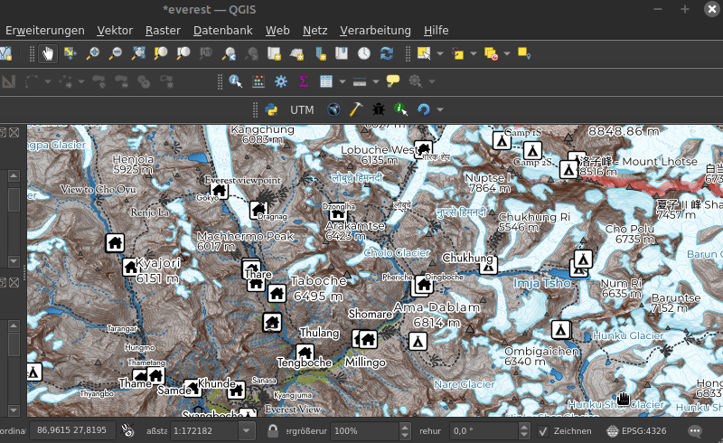

# QGIS Plugin ProjectUTM
QGIS Plugin to set CRS of the Project to the UTM Zone of the area. It takes the central point of the extent of the active layer to look up the corresponding UTM Zone in the pyproj database. Finally the CRS of the project is set.

- Homepage: [https://www.riannek.de/code/qgis-plugin-projectutm/](https://www.riannek.de/code/qgis-plugin-projectutm/)
- QGIS Plugins Repository: [https://plugins.qgis.org/plugins/qgis-project-as-utm/](https://plugins.qgis.org/plugins/qgis-project-as-utm/)
- Git: [https://github.com/florianneukirchen/qgis-project-as-utm](https://github.com/florianneukirchen/qgis-project-as-utm)

*Use the plugin to set the QGIS project to UTM (example map: data © [OpenStreetMap](https://www.openstreetmap.org/copyright/en))*

## Usage 
Select a layer that only contains features within the area of interest, e.g. an opened GPX track. Press the UTM Button in the Plugins Toolbar.

## Install
You can install the plugin with the extension manager in QGIS. Requires pyproj >= 3.0.0 (coming with QGIS >= 3.18).

Or clone / copy the source code into your QGIS plugin folder.

## Changelog
### 1.2 (2024-09)
- Do not crash if no layer is active
### 1.1 (2023-01)
- Set QGIS Minimum Version to 3.18 (the plugin requires pyproj >= 3.0.0) 
### 1.0 (2023-01)
- Warn if layer extent is not fully within UTM zone

### 0.2 (2022-09)
- Now it also works on layers that are not in WGS84 ...
- Do not crash if pyproj did not return any CRS
- Fix typo
### 0.1 (2022-09)
- Initial version

